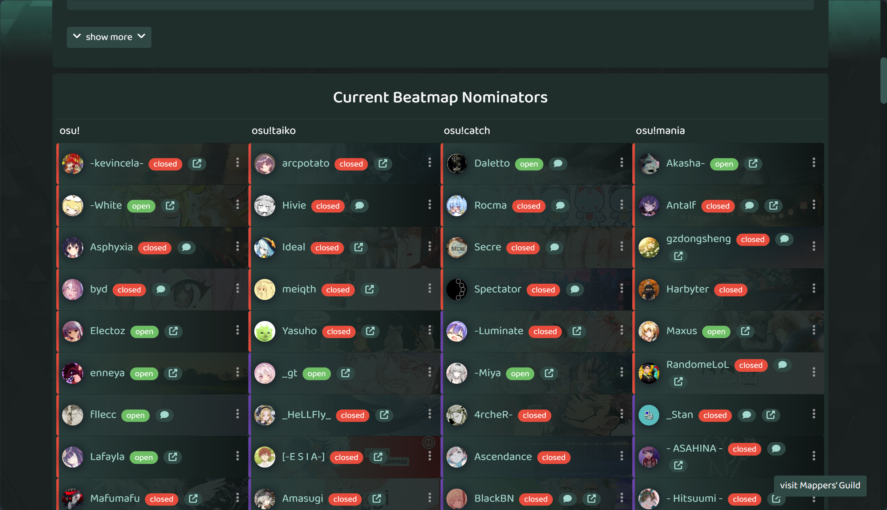

# BNM-Filter

A userscript that filters only opened BNs in [BN Management](https://bn.mappersguild.com/) lists.




<!-- TODO: add true post here -->
Check out the Forum post [Development > BNM-filter | user script](https://osu.ppy.sh/community/forums/topics/2145958?n=1).

## Installation

1. Install a userscript manager like [Tampermonkey](https://www.tampermonkey.net/) or [Greasemonkey](https://www.greasespot.net/)
2. Install the userscript:
   - [Raw File Link](https://raw.githubusercontent.com/SisypheOvO/BNM-Filter/main/dist/bnm-filter.user.js)
3. Visit [BN Management](https://bn.mappersguild.com/) homepage to see it in action. You are all set then.
4. make sure to turn on AutoUpdate in your userscript manager to get the latest updates.

    

## Contributing

Feel free to submit issues and pull requests to improve the script.

### Development

```bash
npm i # install dependencies
npm run build # build the userscript
```

## TODO

- [ ] Maybe add a button for toggling
